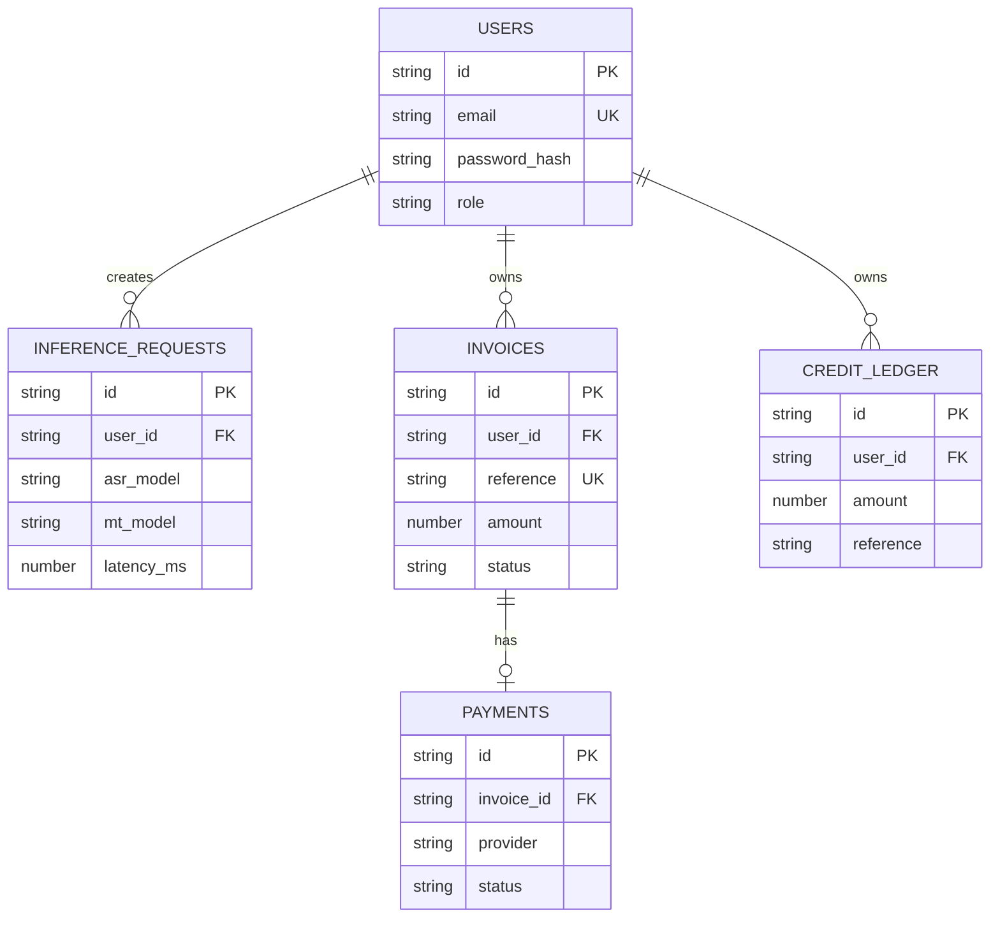

# Data model

```mermaid
erDiagram
 USERS ||--o{ INFERENCE_REQUESTS : creates
 USERS ||--o{ INVOICES : owns
 INVOICES ||--o| PAYMENTS : has
 USERS ||--o{ CREDIT_LEDGER : owns
 USERS { string id PK string email UK string password_hash string role }
 INFERENCE_REQUESTS { string id PK string user_id FK string asr_model string mt_model number latency_ms }
 INVOICES { string id PK string user_id FK string reference UK number amount string status }
 PAYMENTS { string id PK string invoice_id FK string provider string status }
 CREDIT_LEDGER { string id PK string user_id FK number amount string reference }
```
