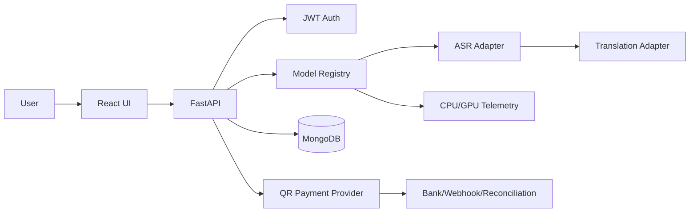

# Flows

```mermaid
flowchart LR
 U[User] --> FE[React UI] --> API[FastAPI]
 API --> AUTH[JWT Auth]
 API --> REG[Model Registry]
 REG --> ASR[ASR Adapter] --> MT[Translation Adapter]
 REG --> TEL[CPU/GPU Telemetry]
 API --> DB[(MongoDB)]
 API --> QR[QR Payment Provider] --> BANK[Bank/Webhook/Reconciliation]
```

Payment không được coi là paid khi chỉ tạo QR; chỉ webhook/reconciliation hợp lệ mới đổi trạng thái.
